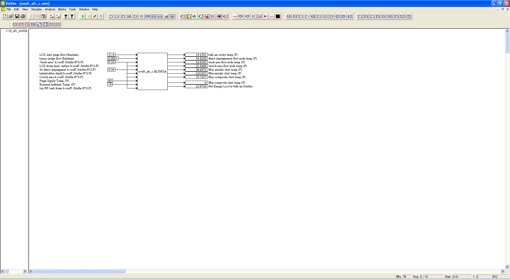

# ========================================
# Orbital Vehicle AFT Purge Analysis using SINDA-G DLL and VISSIM:
# ========================================

## Purge Analysis of Orbital Vehicle AFT using Sinda-G DLL and VISSIM.

##
## I. Operation:
## Ia. Pre-Process: "./SINDA_Preprocess/"
## Ib. SINDA-G DLL Creation for VISSIM: "./SINDA_DLL_Creation/"
## Ic. VISSIM w/ SINDA-G DLL: "./VISSIM_w_SINDA_DLL/"

##
## II. Orbital Vehicle AFT Purge Analysis Top Level Diagram:

## 
## *Note: 
## 1. Performance Data and Analysis performed using VISSIM, ( https://web.solidthinking.com/vissim-is-now-solidthinking-embed )
## 2. Thermal Analysis performed using SINDA-G, ( http://www.mscsoftware.com/product/sinda )
